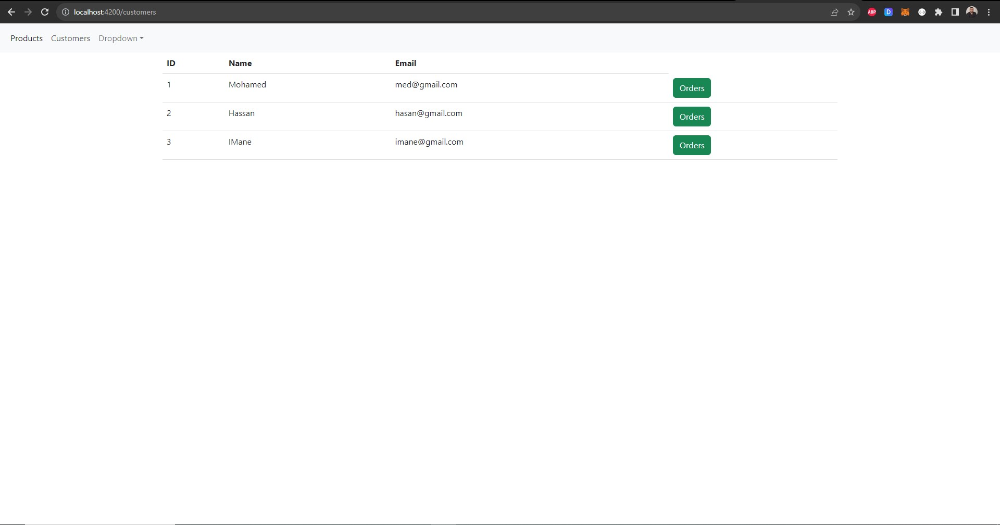

<h1>Microservices E-Commerce: Scalable and Reliable Online Shopping Experiences</h1>

Welcome to our microservices-based e-commerce application, built for resilience and agility! We leverage powerful technologies like Consul Discovery, Spring Cloud Config, Spring Cloud Gateway, Angular, and more to deliver a seamless shopping experience.

<h3>Architecture Overview: </h3>

Consul Discovery: Services find and communicate with each other efficiently.
Spring Cloud Config: Centralized configuration management ensures consistency across deployments.
Spring Cloud Gateway: Unified API entry point simplifies client interactions.
Angular: Responsive and dynamic user interface for smooth interactions.

<h3>Key Components:</h3>

Config Service: Manages centralized configuration and service registration.
Customer Service: Manages customer data and authentication.
Gateway Service: Acts as the primary API entry point and routes requests to microservices.
Inventory Service: Tracks product availability and handles stock modifications.
Order Service: Manages order creation, fulfillment, and tracking.
Billing Service: Securely processes payments using Consul and Vault configurations.
Angular Frontend: Provides a user-friendly interface for browsing, purchasing, and managing orders.

<h3>Technical Highlights:</h3>

Entity Models: Explore entity models for key components like Order, ProductItem, and Customer.
Restful APIs: Utilize CustomerRestClientService and InventoryRestClientService for inter-service communication.
Order Details: See how the fullOrder method enriches orders with customer and product information.
Consul and Vault Integration: Secure configuration with Consul and dynamic secrets management with Vault.

<h3>Get Started:</h3>

Explore the code to delve deeper into service functionalities.
Deploy the application and experience the smooth online shopping journey.

<h5>Configuration des secrets avec vault</h5>

        

        

        
📌 7. FRONTEND ANGULAR (Click to expand 🖱)

<h5>Customers list</h5>

<h5>Products list</h5>

<h5>Orders list</h5>

